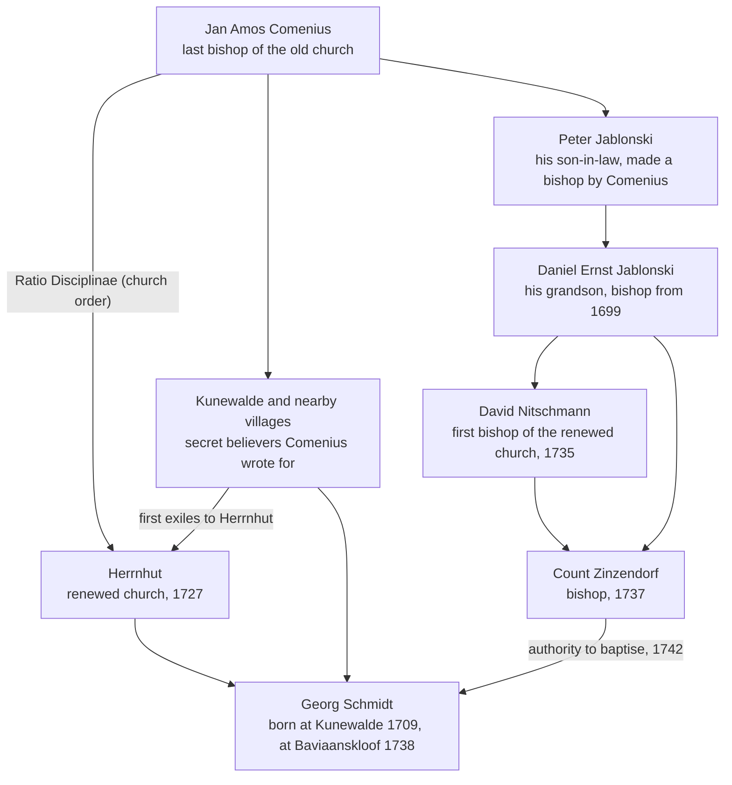

Jan Amos Comenius was a Czech teacher, writer, and church leader [IC]. He was the last bishop of the Unity of the Brethren before it was driven underground, the church later renewed as the Moravian Church [IC]. He is often called the father of modern education [IC]. He died 67 years before Georg Schmidt reached the Cape, so the two men never met [IC]. Still, the line from Comenius to [[history/people/georg-schmidt|Georg Schmidt]] runs through a village, a church order, and a chain of bishops. This page sets out that line.

> [!info] What the letters in square brackets mean
> Facts on this page are followed by a tag that shows where they come from.
>
> - **[IC] Independently Corroborated.** Confirmed by at least two sources that do not depend on each other, or by an official record.
> - **[MS] Mission-Sourced.** Comes from Moravian Church histories and records. These often agree with each other because they share an origin, and have not been checked against sources that do not depend on them.
> - **[TBV] To Be Verified.** Seems likely, but nobody has confirmed it yet.

## At a glance

| | |
| --- | --- |
| Born | 28 March 1592, in Moravia (now the Czech Republic) [IC] |
| Died | 15 November 1670, in Amsterdam. Buried at Naarden in the Netherlands [IC] |
| Church | Unity of the Brethren (Unitas Fratrum), now the Moravian Church [IC] |
| Known for | Arguing that every child should go to school, and writing the first picture book for teaching children [IC] |
| Link to the valley | His church, his writings, and his line of bishops lead to Georg Schmidt and the school at Baviaanskloof |

## His life

Comenius was born in Moravia on 28 March 1592 [IC]. The exact village is not certain, and Nivnice, Uherský Brod, and Komňa are all named [IC]. His parents belonged to the Unity of the Brethren, a Protestant church founded in 1457 by followers of the reformer Jan Hus [IC].

He studied at Herborn (1611 to 1613) and Heidelberg (1613 to 1614) in Germany [IC], and was ordained a minister of the Brethren in 1616 [IC]. He then served as pastor and head of the school at Fulnek, in Moravia [IC].

In 1620 the Protestant side lost the Battle of White Mountain, and the Brethren were banned in Bohemia and Moravia [IC]. Comenius lost his home and property in 1621 [IC]. In 1628 he led a group of Brethren into exile [IC]. Church histories say that at the border, on a spur of the Giant Mountains, he prayed that God would keep a "Hidden Seed" of the church alive in the old homeland, which would one day grow into a tree [MS].

He settled at Leszno in Poland, where he ran the school [IC]. He became a bishop of the Brethren in 1632 [IC]. His ideas made him famous across Europe. He was invited to England in 1641, worked on school reform for Sweden, and taught at Sárospatak in Hungary from 1650 to 1654 [IC]. In 1656 Leszno was burned in war, and he lost his house, his printing press, and many manuscripts [IC]. He spent his last years in Amsterdam, where he died on 15 November 1670 [IC].

## What he believed about learning

Comenius set out his ideas in books that are still read today:

- ***The Gate of Tongues Unlocked*** (*Janua Linguarum Reserata*, 1631) taught language through everyday things and facts about the world [IC].
- ***The Great Didactic*** (*Didactica Magna*, written from about 1628, published 1657) set out a whole system of schooling [IC].
- ***The Visible World in Pictures*** (*Orbis Pictus*, 1658) was the first illustrated book made for teaching children. It paired more than 150 pictures with short texts in Latin and the reader's own language [IC].

His main ideas, in plain terms:

- Every child should go to school: boys and girls, rich and poor [IC].
- Children learn best through their senses, by seeing, touching, and doing [IC].
- Teaching should start in the child's own language [IC].
- Lessons should suit the child's age and stage [IC].
- The natural world is a textbook [IC].

## How he is linked to Georg Schmidt

**1. The same villages.** Late in life, Comenius wrote a catechism for the secret believers still living in Bohemia and Moravia [MS]. He marked the villages it was meant for with initials only, so that they would not be found out [MS]. Church historian J.E. Hutton identifies them as Fulneck, Kunewalde, Zauchtenthal, and five others: the same villages the first exiles came from to renew the church at Herrnhut [MS]. Georg Schmidt was born at Kunewalde on 30 September 1709 [IC]. He grew up among the "Hidden Seed" that Comenius had prayed for.

**2. The same church order.** Comenius published the *Ratio Disciplinae*, an account of how the old church was organised and governed [MS]. Count Zinzendorf read it as the refugee community at Herrnhut grew, and it shaped the Brotherly Agreement that brought the community together in 1727 [IC]. Schmidt joined that community in 1726 [IC].

**3. The same line of bishops.** Comenius made his son-in-law, Peter Jablonski, a bishop [MS]. Peter made his own son, Daniel Ernst Jablonski, a bishop [MS]. Daniel Ernst, Comenius's grandson, became a bishop of the Unity in 1699 [IC]. In 1735 in Berlin he consecrated David Nitschmann as the first bishop of the renewed church [IC]. On 20 May 1737 he and Nitschmann consecrated Zinzendorf [IC]. In 1742 Schmidt, at Baviaanskloof, received his authority to baptise from Herrnhut [IC]. The authority he used for the first baptisms in the valley had come down in an unbroken line from Comenius. The Dutch Reformed ministers at the Cape did not accept it, and this was one reason Schmidt had to leave in 1744 [IC].

**4. The same ideas about teaching?** Schmidt's school at Baviaanskloof matched many of Comenius's ideas. It was open to all who came, taught reading in the local language, and taught through work in the gardens and fields, outdoors under a pear tree [MS]. Whether Schmidt was taught Comenius's methods at Herrnhut, or found the same approach through common sense, has not been shown [TBV]. A 1961 study by Jerome Clauser, *Comenian Pedagogy and the Moravian School Curriculum (1740 to 1850)*, may settle the question. It has not yet been read for this page.

## Why he matters to the valley today

- Genadendal's school has been teaching since 1738, and it is now [[lr-schmidt-primary|L.R. Schmidt Primary School]] [MS]. South Africa's first teachers' training college opened in Genadendal in 1838 [IC]. Both grew out of the church Comenius led.
- The [[concepts/valley-of-grace-learning-campus|Valley of Grace Learning Campus]] idea proposes project-based learning, where a class learns its subjects by working on a real question about the valley. That idea is close to Comenius's view of the world as a textbook.
- The Forum's research on schooling calls the valley's 300-year link to Comenius its strongest and least copied strength as a place of learning [MS].

## What is still open

- What the Clauser study (1961) shows about Comenius's methods in Moravian schools.
- Which village Comenius was born in.
- The exact year of the catechism he wrote for the secret believers.

## Related

- [[history/people/georg-schmidt|Georg Schmidt]]
- [[history/index|Valley History]]
- [[history/history-of-the-valley|History of the Valley]]
- [[future-of-the-valley|Future of the Valley]]
- [[lr-schmidt-primary|L.R. Schmidt Primary School]]
- [[genadendal-mission-museum|Genadendal Mission Museum]]

## References

- Wikipedia. [John Amos Comenius](https://en.wikipedia.org/wiki/John_Amos_Comenius). Birth, studies, exile, travels, works, death, and his grandson Daniel Ernst Jablonski.
- Wikipedia. [Daniel Ernst Jablonski](https://en.wikipedia.org/wiki/Daniel_Ernst_Jablonski). His descent from Comenius, his consecration in 1699, and his consecration of David Nitschmann in 1735.
- Wikipedia. [Nicolaus Zinzendorf](https://en.wikipedia.org/wiki/Nicolaus_Zinzendorf). Zinzendorf's use of the *Ratio Disciplinae*, and his consecration on 20 May 1737.
- Hutton, J.E. (1909). *A History of the Moravian Church*, chapter 16, ["Comenius and the Hidden Seed, 1627 to 1672"](https://www.ccel.org/ccel/hutton/moravian.iv.xvi.html). The 1628 prayer, the catechism for the secret believers, the villages behind its initials, and the line of bishops.
- Christian History Institute. [Between Hus and Herrnhut](https://christianhistoryinstitute.org/magazine/article/between-hus-and-herrnhut). Zinzendorf's reading of the *Ratio Disciplinae* and the renewal of 1727.
- South African History Online. [Georg Schmidt](https://sahistory.org.za/people/georg-schmidt). Schmidt's birth at Kunewalde on 30 September 1709.
- BioConomy Wiki. [The Comenius-to-Schmidt Chain](https://wiki.bioconomy.earth/research/comenius-to-schmidt-chain/). The case for a link between Comenius's ideas and Schmidt's teaching.
- Clauser, J.K. (1961). *Comenian Pedagogy and the Moravian School Curriculum (1740 to 1850).* D.Ed. dissertation, Pennsylvania State University. Not yet read.
